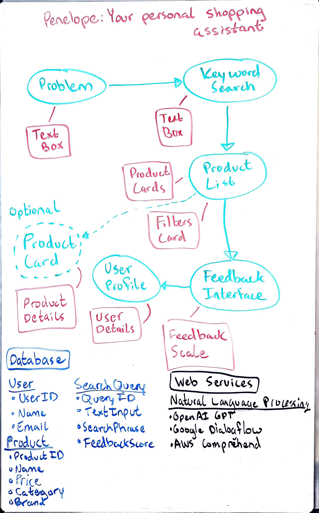

# Penelope

Penelope helps retail customers find the exact product they need using an online digital shopping assistant. Leveraging AI, Penelope not only organizes products into a digital directory but also makes intelligent, context-aware recommendations. The traditional search bar is outdated—Penelope ushers in the era of the digital shopping assistant.

## Overview

Penelope addresses the challenges faced by both vendors and customers in the retail market by enhancing product listings and transforming the shopping experience. By integrating advanced AI models, Penelope empowers users with smart recommendations and personalized shopping journeys, making it easier than ever to find the right product at the right time.

## Specification Deliverable

### Elevator Pitch

Have you ever struggled with poorly presented product listings or spent hours trying to find the right product online? Penelope is here to change that. Our digital shopping assistant replaces the need for offsite research by asking the right questions, understanding your needs, and providing personalized recommendations. With Penelope, finding the perfect product is no longer a guessing game—it’s a seamless experience.

### Design
A simple overview of the application's atchitecture.

The architecture creates a tailored shopping experience for customers, all powered by AI and machine learning algorithms. While this design and project will be focused on developing the core features of Penelope, there will be many opportunities to add and enhance the application in the future.

## Key Features

- **Context-Aware Recommendations**: Shopping assistant asks insightful questions to refine search prompts and enhance product discovery.
- **Community-Driven Insights**: Recommendations are enriched with reviews and feedback from the community.

## Technologies

Penelope utilizes a range of modern technologies to deliver a unique shopping experience:

- **HTML & CSS**: Structured pages with responsive design tailored for both desktop and mobile users.
- **React**: Component-driven architecture for dynamic, interactive interfaces.
- **Service**: Powers the shopping assistant’s recommendation engine, utilizing natural language processing (NLP) to understand and respond to customer needs. Backend service with endpoints for:
    - login
    - NLP processing
    - search processing
    - collecting feedback
- **Database Integration**: Manages user profiles, product details, and interaction data securely.
- **WebSocket**: Provides real-time customer service chats.
