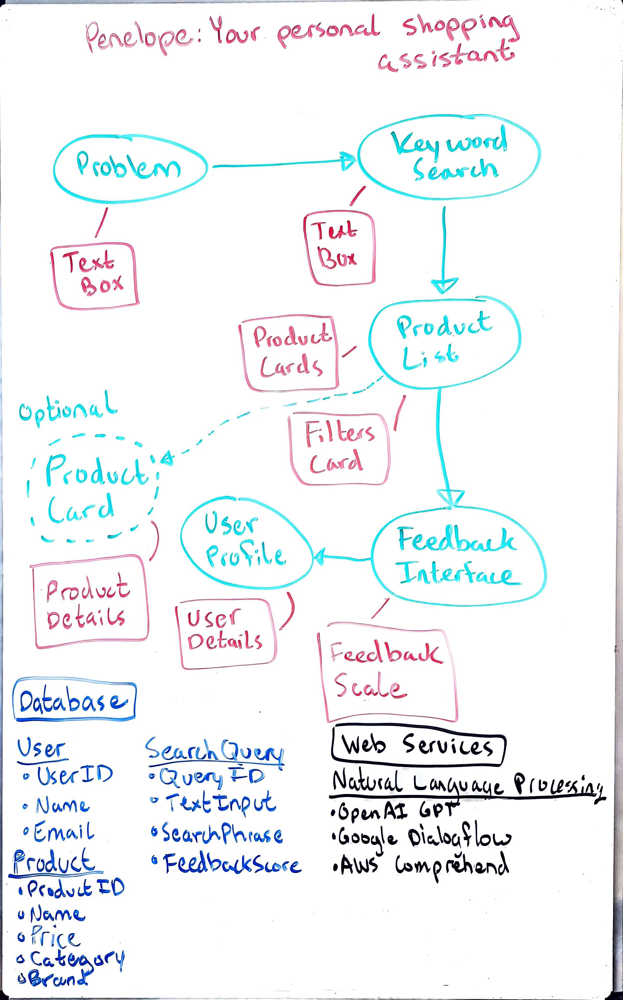
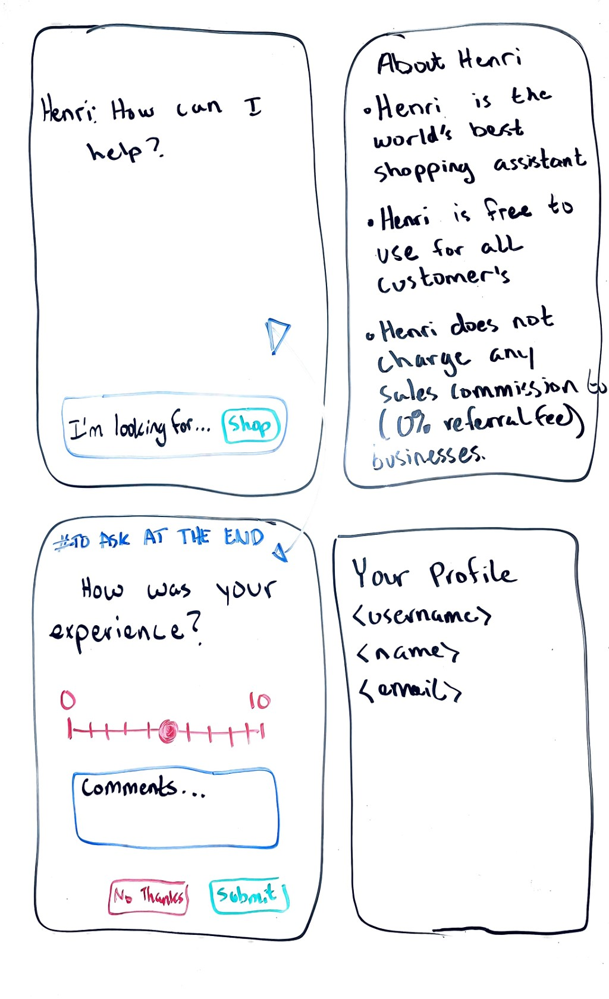

# Henri

Henri helps retail customers find the exact product they need using an online digital shopping assistant. Leveraging AI, Henri not only organizes products into a digital directory but also makes intelligent, context-aware recommendations. The traditional search bar is outdated—Henri ushers in the era of the digital shopping assistant.

## Overview

Henri addresses the challenges faced by both vendors and customers in the retail market by enhancing product listings and transforming the shopping experience. By integrating advanced AI models, Henri empowers users with smart recommendations and personalized shopping journeys, making it easier than ever to find the right product at the right time.

## Specification Deliverable

### Elevator Pitch

Have you ever struggled with poorly presented product listings or spent hours trying to find the right product online? Henri is here to change that. Our digital shopping assistant replaces the need for offsite research by asking the right questions, understanding your needs, and providing personalized recommendations. With Henri, finding the perfect product is no longer a guessing game—it’s a seamless experience.

### Design
A simple overview of the application's atchitecture.

The architecture creates a tailored shopping experience for customers, all powered by AI and machine learning algorithms. While this design and project will be focused on developing the core features of Henri, there will be many opportunities to add and enhance the application in the future.

## Key Features

- **Context-Aware Recommendations**: Shopping assistant asks insightful questions to refine search prompts and enhance product discovery.
- **Community-Driven Insights**: Recommendations are enriched with reviews and feedback from the community.

## Technologies

Henri utilizes a range of modern technologies to deliver a unique shopping experience:

- **HTML & CSS**: Structured pages with responsive design tailored for both desktop and mobile users.
- **React**: Component-driven architecture for dynamic, interactive interfaces.
- **Service**: Powers the shopping assistant’s recommendation engine, utilizing natural language processing (NLP) to understand and respond to customer needs. Backend service with endpoints for:
    - login
    - NLP processing
    - search processing
    - collecting feedback
- **Database Integration**: Manages user profiles, product details, and interaction data securely.
- **WebSocket**: Provides real-time customer service chats.

## HTML Deliverable

### Design
The design was slightly modified to accomodate the requirements of the HTML deliverable. Some pages were added, some discarded. It's likely that in the future that page utility will be combined into a single user interface under index.html.

### Details

- [x] **HTML Pages**: Varios HTML pages displaying 3rd party services and database information:
    - An index landing page with an example of the inputs and outputs that will be provided by the LLM.
    - User pages focused on user forms required to track and display user data.
    - Vendor pages focused on vendor forms required to track and display product data.
    - An About Me page that give a brief description of the website and a contact submission form.
- [x] **Links**: A rudimentary nav bar with links to various core pages- accessible from every page. A rudimentary user bar that has a login/username link. Some pages have static links in the body to relevant database information- these links will be dynamic in the future.
- [x] **Text**: Static example and filler text on various pages representing database information- these texts will be dynamic in the future.
- [x] **Images**: Added an example product image to the product page. Added the Henri logo to each page.
- [x] **DB/Login**: Login page for users with a login form and submit button. Various other forms to modify DB data.
- [x] **WebSocket**: The count of inventory amounts to ensure that customers do not purchase out of stock items.

## CSS deliverable

### Design

### Details

- [ ] **Header, footer, and main content body**:
- [ ] **Navigation elements**:
- [ ] **Responsive to window resizing**:
- [ ] **Application elements**:
- [ ] **Application text content**:
- [ ] **Application images**:

## React deliverable

### Design

### Details

- [ ] **Bundled and transpiled**:
- [ ] **Components**:
    - [ ] **login**:
    - [ ] **database**:
    - [ ] **WebSocket**:
    - [ ] **application logic**:
- [ ] **Router**:
- [ ] **Hooks**:

## Service deliverable

### Design

### Details

- [ ] **Node.js/Express HTTP service**:
- [ ] **Static middleware for frontend**:
- [ ] **Calls to third party endpoints**:
- [ ] **Backend service endpoints**:
- [ ] **Frontend calls service endpoints**:

## DB/Login deliverable

### Design

### Details

- [ ] **MongoDB Atlas database created**:
- [ ] **Stores data in MongoDB**:
- [ ] **User registration**:
- [ ] **existing user**:
- [ ] **Use MongoDB to store credentials**:
- [ ] **Restricts functionality**:

## WebSocket deliverable

### Design

### Details

- [ ] **Backend listens for WebSocket connection**:
- [ ] **Frontend makes WebSocket connection**:
- [ ] **Data sent over WebSocket connection**:
- [ ] **WebSocket data displayed**:
